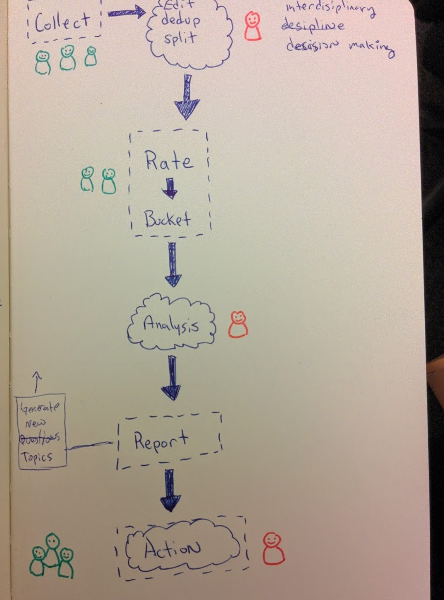

## team decision making

Sept 4th, 2014 Pips was explaining a method for collecting information from groups that went through a process to generate a report that was useful for decision making.  I forget the name of the process but while she was explaining it I had to get my brain's thought process on the flow captured because I thought it would be very easy to do as a simple web app.  The collecting, rating, and bucketing process is the easy part of this (relatively).  The post-processing, analysis, and reporting is where things get more complicated.

The sketcbook entry looks like:

